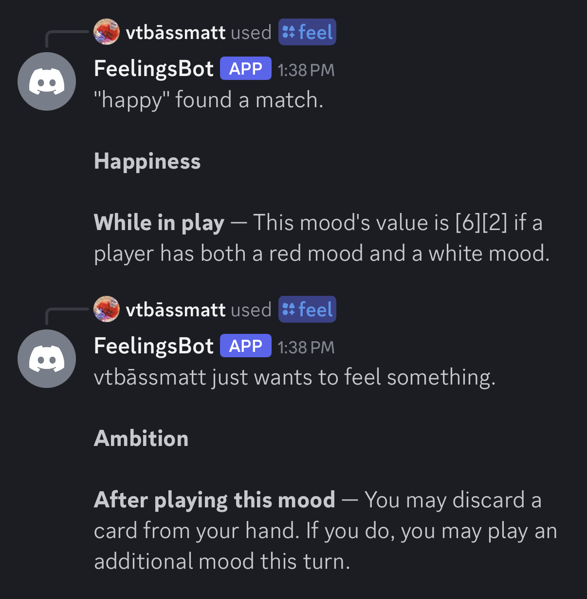

# FeeelingsBot

A Discord bot for Mood Swings.

# Commands

* `/feel <card name>` - show the text of a card. Leave "card name" blank to have the server pick a random one.
  
* `/search <query>` - use full Feelings search text. This isn't hooked up yet, sorry!

Code derived from https://github.com/discord/cloudflare-sample-app.
